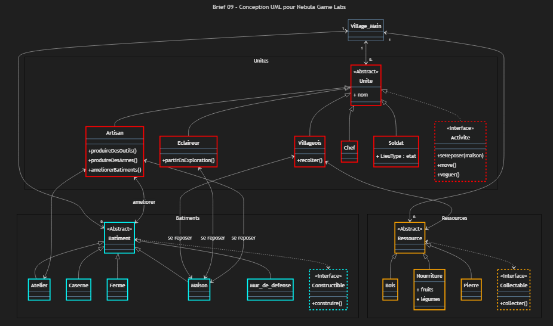
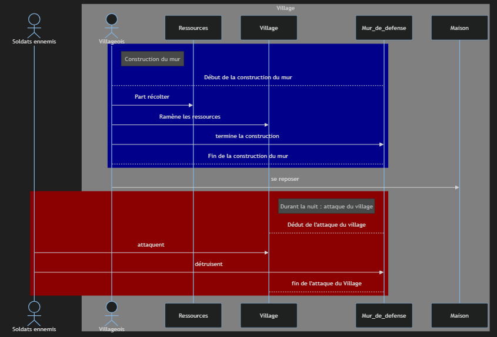

# Brief-08---Un-RTS-pour-Nebula-Game-Labs

Pour lancer le projet :
- Ouvrir le dossier
- Lancer l'appli directement avec la touche F5 (possibilité offerte en rajoutant "console": "internalConsole" dans .vscode/{launch.json})

````
{
    "version": "0.2.0",
    "configurations": [
        {
            "type": "java",
            "name": "Current File",
            "request": "launch",
            "mainClass": "${file}"
        },
        {
            "type": "java",
            "name": "Main",
            "request": "launch",
            "mainClass": "Main",
            "projectName": "Brief-08---Un-RTS-pour-Nebula-Game-Labs_c78ec84d",
            "console": "internalConsole"
        }
    ]
}
````

=> Les fonctionnalités appraissent dans le Main.java

=> L'ensemble des actions réalisées par l'appli apparaissent alors dans la console de débogage.

=> Dans Terminal/Problèmes appraissent en TODO les tâches à finaliser

# Brief-09---Conception UML pour Nebula Game Labs

Les diagrammes UML demandés pour documenter le code sont présents dans les fichiers : 

- Diagramme_de_classe.md


- SequenceDiagram.md



