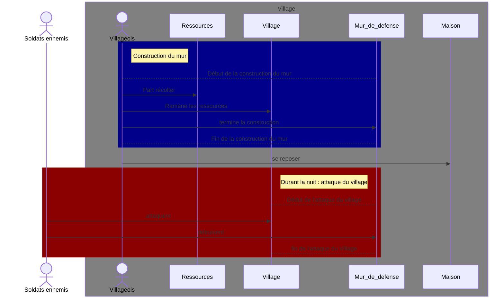

```mermaid

sequenceDiagram

    actor S as Soldats ennemis
    box grey Village
        actor Villageois
        participant Ressources
        participant Village
        participant Mur_de_defense
        participant Maison
    end

    rect rgb(0, 0, 139)
    note right of Villageois: Construction du mur

    Villageois-->Mur_de_defense: Début de la construction du mur
    Villageois->>Ressources: Part récolter
    Villageois->>Village: Ramène les ressources
    Villageois->>Mur_de_defense: termine la construction
    Villageois-->Mur_de_defense: Fin de la construction du mur
    end

    Villageois->>Maison: se reposer

    rect rgb(139, 0, 0)
    note right of Village: Durant la nuit : attaque du village
    Village-->Mur_de_defense: Dédut de l'attaque du village
    S->>Village: attaquent
    S->>Mur_de_defense: détruisent
    Village-->Mur_de_defense: fin de l'attaque du Village
    end

```